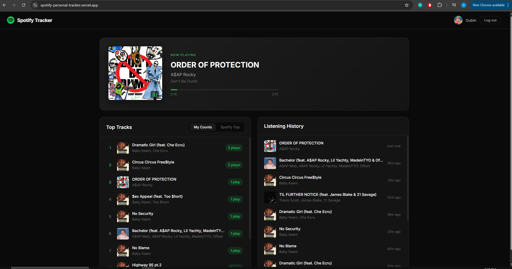

# Spotify Personal Tracker

A full-stack web application that tracks your Spotify listening habits in real-time. See what you're currently playing, track how many times you've listened to each song, and browse your listening history — all in a sleek, dark Spotify-inspired UI.

**Live App:** [spotify-personal-tracker.vercel.app](https://spotify-personal-tracker.vercel.app)



## Features

- **Now Playing** — Real-time display of your currently playing track with album art, progress bar, and animated equalizer
- **Play Count Tracking** — Automatically counts how many times you listen to each song, building your personal top tracks over time
- **Listening History** — Scrollable timeline of recently played songs with relative timestamps
- **Spotify Top Tracks** — View your top tracks as calculated by Spotify's own algorithm
- **Multi-User Support** — Anyone with a Spotify account can log in and track their own listening data independently

## Tech Stack

| Layer | Technology |
|-------|-----------|
| Frontend | React, Vite |
| Backend | Node.js, Express |
| Database | SQLite (better-sqlite3) |
| Auth | Spotify OAuth 2.0 (Authorization Code Flow) |
| Hosting | Vercel (frontend), Railway (backend) |

## Architecture

```
Client (React + Vite)          Server (Express)            Spotify API
┌─────────────────┐       ┌──────────────────────┐     ┌──────────────┐
│                 │       │                      │     │              │
│  NowPlaying ────┼──────►│  GET /api/now-playing ┼────►│  Currently   │
│  (polls 5s)     │       │                      │     │  Playing     │
│                 │       │  GET /api/top-tracks  │     │              │
│  TopTracks  ────┼──────►│  (local play counts)  │     │  Top Tracks  │
│                 │       │                      │     │              │
│  History    ────┼──────►│  GET /api/history     │     │  Recently    │
│  (polls 15s)    │       │                      │     │  Played      │
│                 │       │                      │     │              │
│  Login ─────────┼──────►│  OAuth flow ──────────┼────►│  Auth        │
│                 │       │                      │     │              │
└─────────────────┘       └──────────┬───────────┘     └──────────────┘
                                     │
                                     ▼
                              ┌──────────────┐
                              │   SQLite DB   │
                              │  - users      │
                              │  - history    │
                              │  - play_counts│
                              └──────────────┘
```

## Getting Started

### Prerequisites

- Node.js 20+
- A [Spotify Developer](https://developer.spotify.com/dashboard) application with Client ID and Secret

### Setup

1. **Clone the repo**
   ```bash
   git clone https://github.com/GubinGeramifard/Spotify-Personal-Tracker.git
   cd Spotify-Personal-Tracker
   ```

2. **Configure environment variables**

   Create `server/.env`:
   ```env
   SPOTIFY_CLIENT_ID=your_client_id
   SPOTIFY_CLIENT_SECRET=your_client_secret
   SPOTIFY_REDIRECT_URI=http://127.0.0.1:3001/auth/callback
   FRONTEND_URL=http://localhost:5173
   SESSION_SECRET=any_random_string
   PORT=3001
   ```

3. **Add redirect URI in Spotify Dashboard**
   - Go to your app settings on [developer.spotify.com](https://developer.spotify.com/dashboard)
   - Add `http://127.0.0.1:3001/auth/callback` as a Redirect URI

4. **Install and run**
   ```bash
   # Terminal 1 — Backend
   cd server
   npm install
   node index.js

   # Terminal 2 — Frontend
   cd client
   npm install
   npm run dev
   ```

5. **Open** `http://localhost:5173` and connect your Spotify account

## Project Structure

```
spotify-tracker/
├── client/                  # React + Vite frontend
│   ├── src/
│   │   ├── components/
│   │   │   ├── NowPlaying.jsx
│   │   │   ├── TopTracks.jsx
│   │   │   ├── TrackHistory.jsx
│   │   │   ├── LoginButton.jsx
│   │   │   └── Layout.jsx
│   │   ├── App.jsx
│   │   ├── main.jsx
│   │   └── index.css
│   ├── vite.config.js
│   └── package.json
├── server/                  # Express backend
│   ├── routes/
│   │   ├── auth.js          # Spotify OAuth flow
│   │   └── tracks.js        # Track data endpoints
│   ├── db.js                # SQLite setup + queries
│   ├── index.js             # Server entry point
│   ├── Dockerfile
│   └── package.json
└── README.md
```

## API Endpoints

| Method | Endpoint | Description |
|--------|----------|-------------|
| GET | `/auth/login` | Initiates Spotify OAuth flow |
| GET | `/auth/callback` | OAuth callback handler |
| GET | `/auth/me` | Returns current user info |
| POST | `/auth/logout` | Clears user session |
| GET | `/api/now-playing` | Currently playing track |
| GET | `/api/top-tracks` | Locally tracked play counts |
| GET | `/api/top-tracks/spotify` | Spotify's top tracks |
| GET | `/api/history` | Recent listening history |
| GET | `/health` | Health check |
